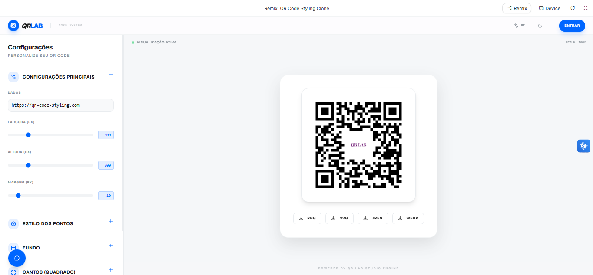

# 🚀 QR Lab Studio

## 📝 Descrição do Projeto
Este projeto consiste em um laboratório avançado de criação e estilização de QR Codes de alto desempenho. O objetivo principal é transformar códigos QR genéricos em peças de design únicas, permitindo a total personalização de cores, formas, logotipos e gradientes, garantindo que a identidade visual de marcas e empresas seja preservada.

Desenvolvido como uma aplicação Full-Stack moderna (2024), o sistema utiliza uma arquitetura robusta para processar personalizações em tempo real, oferecendo exportações em múltiplos formatos (PNG, SVG, JPEG, WEBP) e armazenamento seguro em nuvem para usuários autenticados.


*Figura 1: Dashboard principal do sistema exibindo ferramentas de estilização em tempo real.*

## 🚀 Tecnologias Utilizadas
*   **Frontend:** React 18 + Vite
*   **Estilização:** Tailwind CSS + Framer Motion
*   **Backend & Cloud:** Firebase (Authentication, Firestore, Analytics)
*   **IA de Suporte:** Google Gemini Pro (Assistência Inteligente via chat)
*   **Biblioteca Core:** QR-Code-Styling

## 📊 Resultados e Aprendizados
O projeto alcançou um nível de maturidade técnica elevado, integrando múltiplos serviços de nuvem de forma transparente.
*   **Performance:** Otimização de renderização via Canvas API para feedback visual instantâneo.
*   **Monitoramento:** Implementação completa de Firebase Analytics para rastreamento de conversão (downloads) e usabilidade.
*   **Escalabilidade:** Arquitetura baseada em Context API para gestão de estado global e persistência de preferências do usuário.
*   **IA Generativa:** Integração de assistente virtual para guiar o usuário na escolha de melhores práticas de contraste e legibilidade.


*Figura 2: Monitoramento de métricas de uso e engajamento via Firebase.*


[Voltar ao início](https://github.com/GuilhermeVerardino/portfolio-guilherme-lourenco-verardino)

## 🔧 Como Executar
1. Clone o repositório.
2. Instale as dependências:
```bash
npm install
*


